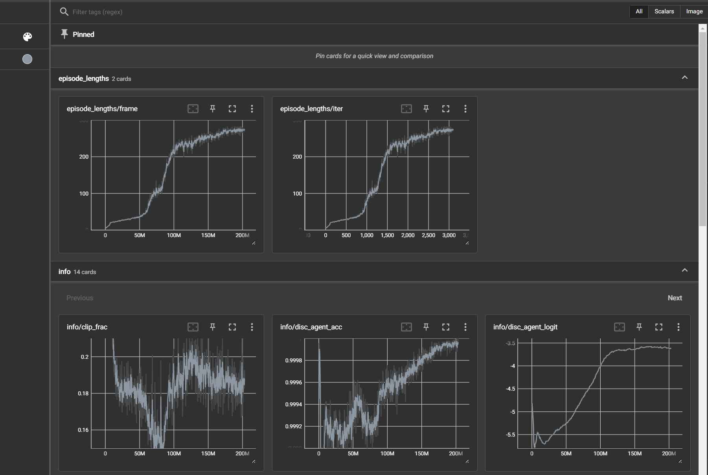
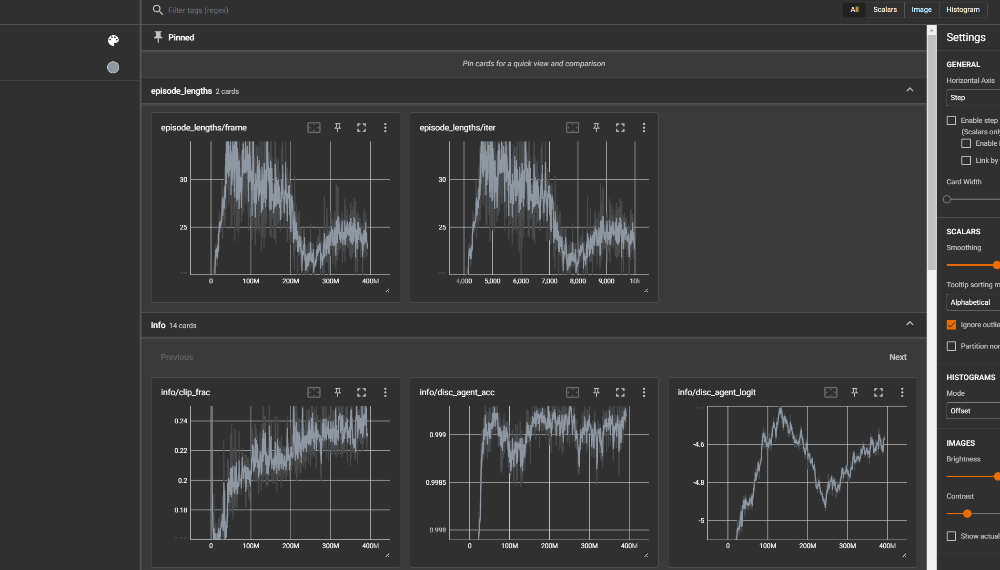

## 10.24 
在random的mf的pretrain下，仅仅加入3cc的mf，即使不改变clip pd的output，就与random的mf下进行test结果不同，avg steps从250显著降低至214；（是合理的）
## 10.28
在加入3cc的改变pd_tar进行clip下，backflip训练length无法超过30帧，学不到
- pd_tar的改变是通过下面的代码实现的，按默认pd_torque的计算方式，直接计算需要被clip的值来改变pd_tar，从而实现对torque的clip（逻辑上只要原本的仿真是稳定的，这样的更改也是稳定的）；另外3cc是与仿真步同步更新的
  ```python
  elif self._3cc_control_:
        # calculate the target load for 3cc input
        torque_max=np.load(self.max_torque_file).reshape((1, -1))
        torque=np.zeros_like(pd_tar.cpu().numpy())
        dof_pos = (self._dof_pos).cpu().numpy()
        dof_vel = (self._dof_vel).cpu().numpy()
        torque[:,:]=-100*(dof_pos[:,:]-pd_tar[:,:].cpu().numpy())-10*dof_vel[:,:]
        self.dof_tl[:,:]=torch.from_numpy(abs(torque[:,:])/torque_max[0,:])
        # use temp mf to clip
        temp_rc=1-self.dof_mf.cpu().numpy()
        condition=(temp_rc<self.dof_tl.cpu().numpy()) # only clip those exceed the rc
        pd_offset=np.zeros_like(pd_tar.cpu().numpy())
        pd_offset[condition]=(self.dof_tl.cpu().numpy()[condition]-temp_rc[condition])*(torque_max*condition)[condition]/100
        condition2=(torque>0)
        pd_offset[condition2]=pd_offset[condition2]*(-1)
        pd_tar[:,:]=pd_tar[:,:]+torch.from_numpy(pd_offset[:,:]).to(self.device)
    ```
- 对backflip的模仿在没有3cc之前是稳定的

- 加入后

- 后续对mf等和tl和具体的torque值打表检查一下