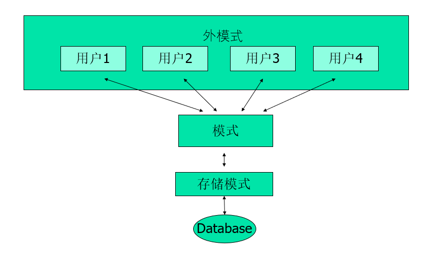

DB HW 1
> 喻勃洋 2000011483 信科21级
- Q1:谈谈你对数据独立性的理解。数据库系统是从哪些方面来提高数据独立性的？   
  - 数据独立性：从数据和应用程序的角度理解，数据独立性主要体现在其结构变化的适合可以较好的转换以适配同样的应用程序。因此可以说数据独立性是一个良好的应用程序（数据管理程序）和数据各类结构之间的适配性设计，使得两者不互相依赖，较为通用。
  - 数据库系统提高数据独立性的方法：
    - 把数据库定义和描述从应用程序中分离出去——独立定义
    - 数据描述是分级的——分级逻辑
    - 由系统管理数据存取——为应用程序提供统一的数据接口
- Q2:比较数据库系统和文件系统在数据管理方面的不同，列出至少四个不同之处（可以做一个表格来展示）
  - A:
  - 
  | 方面                     | 数据库系统                                  | 文件系统                                     |
  |-------------------------|--------------------------------------------|---------------------------------------------|
  | 数据结构                | 结构化，以表格形式组织，具有行和列。           | 无结构或半结构化，以文件形式存储，没有预定义的结构。     |
  | 查询方式                | 支持SQL或其他查询语言进行复杂的数据检索和操作。    | 支持有限或没有查询语言，通常通过文件路径访问数据。       |
  | 可扩展性和性能           | 设计为可扩展，集中管理，数据容易扩充     | 可能会受到可扩展性问题的影响，特别是对于大型数据集和并发访问。 |
  | 并发控制                | 提供诸如锁定和事务等机制来管理并发访问，并确保一致性。 | 对并发控制的支持有限，可能导致多用户环境中的数据不一致。   |
  | 数据独立性               | 高独立性，应用程序和数据结构高度分离 | 独立性较差   |
  | 统一存取和数据语义维护   | 由DBMS统一存取，维护数据语义及结构。               | 无此支持，数据访问和语义维护可能因应用程序不同而不一致。  |

- Q3:列举两个不适合使用数据库而应该基于文件系统的应用，并给出简单的解释    
  - 个人的项目或者小规模的数据处理应用或应用程序：在小规模数据处理且仅有单个用户的情况下，这样的应用程序通常不需要数据库的复杂功能和并发控制，所以直接将数据存储在文本文件中即可满足需求，文件系统简单经济，避免了引入数据库系统的额外开销和复杂性。
  - 主要用于本地存储的应用程序（影音资料）：对于需要在本地存储大量数据的应用程序，如图像编辑软件、音乐播放器等，使用文件系统可以提供更直接的数据管理方式。一般这样的应用程序通常需要快速的读写速度和简单的数据访问方式，而文件系统足以提供这些需求，无需数据库。

- Q4:对不同模型（层次、网状、关系、面向对象模型）从模型结构、表达能力、数据独立性、操作简便性等方面比较其不同（也可以做一个表格来展示） 

  - 
  | 方面           | 层次模型 | 网状模型 | 关系模型 | 面向对象模型 |
  |---------------|----------|----------|----------|--------------|
  | 模型结构      | 树形结构 | 图形结构 | 平面表格 | 对象结构     |
  | 表达能力      | 适合层次关系 | 适合复杂关系 | 适合简单和复杂关系 | 适合真实世界对象关系 |
  | 数据独立性    | 数据紧耦合 | 数据复杂耦合 | 数据逻辑分离 | 数据对象关系灵活 |
  | 操作简便性    | 简单操作 | 复杂操作 | 直观操作 | 直接对象操作 |

- Q5:如果采用多维数组作为数据模型，它比较适合管理哪些应用场景的数据？（可以从数组的有序性和关系模型集合的无序性角度入手）
  - 采用多维数组作为数据模型时，它更适合管理那些具有明显的 __有序性和规律性__ 的数据。例如，当数据可以以多维表格的形式进行组织和表示时，多维数组就非常适合。比如用于存储二维地图上每个点的高度信息，或者用于存储三维立体图像中的像素值。在这些情况下数据有序性和连续性很强，数据的组织和关系相对简单明确，可以很自然地映射到多维数组的结构上。

- Q6:画出数据库三层模式架构图，简单说明一下模式分层的好处。 
  - 
  - 好处：首先，三级模式是模式、外模式、存储模式，层级之间是映像。因此这样提高了数据独立性，因为应用程序是不会直接接触数据的物理存储形式的。且隔离性好，扩展性强。

- Q7:搜索引擎的关键字查询和数据库查询有何不同？试从查询方式和查询结果来比较 
  - 从方式上：搜索引擎是提供关键字来进行相关性查询，输入关键信息查询，按一定的算法排序返回相关性更高的结果；而数据库查询是基于结构化的数据，通过SQL等查询语言来进行复杂的数据检索和操作，可以进行更复杂的查询操作，且返回的结果是符合查询条件的确定的集合，而不是按相关性排序的结果。
  - 从结果上：搜索引擎返回的结果是按相关性排序的，而数据库查询返回的结果是符合查询条件的确定的集合，一组记录。

- Q8:DBMS的主要数据控制功能应该有哪些？如果有一个淘宝达人想基于单机版数据库比如Access记录自己的购物流水，上面的哪些功能是他所不需要的？
  - 主要数据控制功能：数据库运行管理、数据库语言和应用程序接口（组织存储管理）、数据库设计、实现、维护工具、数据库通信接口管理等等
  - 淘宝达人不需要的：
    - 数据库运行管理、数据库建立和维护功能、数据库通信接口

- Q9:DBA应该履行哪些职能？相应的他又应该具备哪些技能？
  - 职能：建库：设计数据库，选择合适的数据库管理系统，建立数据库；维护库：监控数据库的运行状态，规定用户权限，保证数据库的安全性和完整性；优化库：监控性能，对数据库进行性能优化，提高数据库的运行效率。
  - 需要技能：数据库设计和管理技能，安全管理技能，性能优化技能。或者说技术。

- Q10:自己尝试从概念上解释一下什么是DB for AI？什么又是AI for DB？
  - 简单的理解概念：DB for AI是指数据库系统为人工智能提供数据支持，为AI算法提供数据存储和管理。从AI研究需要的大量dataset来看这一点在ai训练尤其是多人协作的时候尤为重要。而AI for DB是指人工智能技术为数据库系统提供数据分析和处理的能力，为数据库系统提供智能化的数据管理和分析功能。
