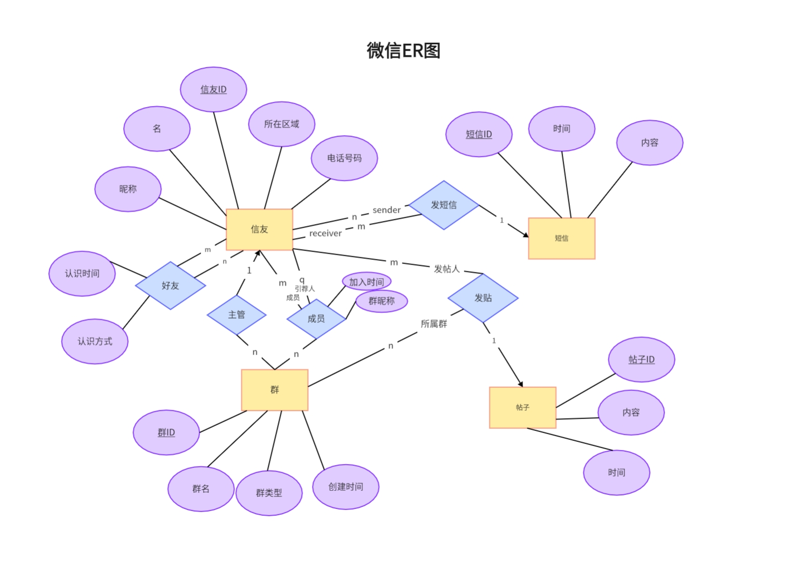

# 数据库HW2 ER模型
> 喻勃洋 2000011483 21级信科
## Q1
- 聚集：
  - 例子：图书馆管理中，书籍、读者和借书记录，读者和书籍之间形成借阅关系，而在这个二元关系的基础上，与借书记录产生对应。
  - 优点：这种聚集明确了三个实体集之间的关系，而不必用复杂的二元联系来描述这样紧密相关有序的关系，从而优化了逻辑结构，同时在查询上也可以从借书记录有序地查到聚集的实体集后再查找对应的内部实体集。
- 弱实体集：
  - 例：医院开具的处方就是弱实体集，因为处方依赖于强实体集——患者，每个患者可能对应多个处方，从而处方的主码可以根据患者的证号外加处方号来唯一确定。同时处方还会与药房等实体集发生开药等关系。因此要作为实体集存在。
  - 优点：可以更好的建模这种依赖关系，避免了冗余数据的患者信息重复存储。
- 细化&泛化：
  - 例：车辆中，四轮汽车可以细化为轿车、卡车、越野车等，从而关注不同的性能指标。而越野车又可以和越野摩托车等进行泛化为越野载具，从而关注共同的越野性能指标。
  - 优点：细化可以更好的建模实体之间的层次关系，增加了丰富性和描述的精确性；泛化简化了模型的结构，减少了冗余的属性设立。更好的进行数据分析和查询。

## Q2

## Q3

## Q4

## Q5

## Q6
航班：
- 航班号（主键）：唯一标识航班的编号
- 日期：航班执行日期
- 时间：航班执行时间
- 机组成员：参与执行该航班的机组成员

航线：
- 航线ID（主键）：唯一标识航线的编号
- 起始机场：航线的起始机场
- 终点机场：航线的终点机场

机场：
- 机场代码（主键）：机场的IATA代码，用于唯一标识机场
- 机场名称：机场的名称
- 所在城市：机场所在城市的名称

机组：
- 机组ID（主键）：唯一标识机组的编号
- 机组成员：包括机长、副驾驶和乘务人员等

飞机：
- 注册号（主键）：飞机的注册号，用于唯一标识飞机
- 飞机型号：飞机的型号
- 所属航空公司：拥有该飞机的航空公司

飞行员：
- 员工编号（主键）：飞行员的员工编号，用于唯一标识飞行员
- 姓名：飞行员的姓名
- 飞行经历：飞行员的经验和资质等级

航司：
- 航司代码（主键）：航空公司的IATA代码，用于唯一标识航空公司
- 航司名称：航空公司的名称
  
