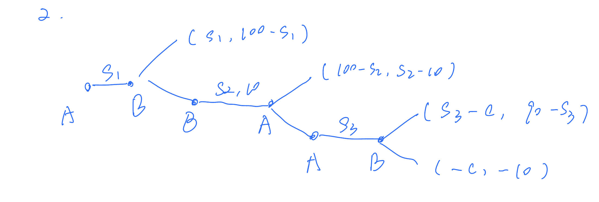

# 博弈与社会作业2
>喻勃洋 2000011483
<link rel="stylesheet" href="/md.css">

## 题目1
### 1）
有$\lambda x<p$,则对P来说，上法庭的子博弈中放弃更优，P选择放弃；
因此在D的接受庭外和解与否的子博弈中，接受的收益是-s,不接受是0，因此D不接受；
则对于P提出指控与否的博弈，指控收益为-c,不指控为0；因此P选择不指控。
综上，P不指控构成子博弈精炼纳什均衡。

### 2）
由于P的告法庭与否的子博弈中，此时对P上法庭的收益总是高于放弃，因此P选择上法庭；
则在D的接受庭外和解与否的子博弈中，接受的收益是-s,不接受是$-\lambda x-d$，因此当$s<\lambda x+d$，D会选择接受庭外和解；
而同时P若会选择指控则要求$s-c-p>0$，故$s>c$，因此有$c+p<s<\lambda x+d$时，双方会走向庭外和解。
而依题意，有等价于$\lambda x+d>c+p$，则总存在符合上一条件的s，P提出该s后使得两人走向庭外和解，即P指控，提出s，D接受，构成子博弈精炼纳什均衡。
在这个博弈中，P提前支付了诉讼费用从而减少了最终上法庭的附加成本，P上法庭的意愿更高，导致了D不愿被诉讼后赔偿更多而选择了庭外和解。

## 题目2
认为本题所有提议的支付成本都是必须付出的，无论对方接不接受。
有图：
### 1）
分析：
对于第三回合的李四，面临90-s3与-10的决策，则只要$s3<100$则李四总会接受；因此对于第三回合的张三，会将s3定为很接近100的值，以最大化自己的利益，因此可以近似认为在第三回合的子博弈中张三的最好收获为100-c,李四的收获为-10。
再看第二回合，面对李四的出价s2，张三在100-s2与100-c间决策，因此只要$s2<c$，则张三会接受。
分类：
- c=0:
  - 则李四无法给出s2使得张三接受，因此第二回合张三无论如何都不会接受，第二回合的子博弈结果与第三回合相同。
  - 再看第一回合，面对张三的出价s1，李四在-10和100-s1中间决策，则无论s1是多少，李四都会接受，因此第一回合李四无论如何都会接受。
  - 则张三会出价s1=100，李四接受，张三收益为100，李四收益为0，（100，0），这是一个精炼纳什均衡。
- c=80:
  - 则李四会出价s2接近80，近似为80，第二回合的结果为（20，70）。
  - 则第一回合，面对张三的出价s1，李四在70和100-s1中间决策，因此只要s1<30，李四会接受，因此张三会出价s1接近30，此时张三收益高于20，符合张三的理性。精炼纳什均衡的结果为（30，70）。
- c=10:
  - 则李四会出价s2接近10，近似为10，第二回合的结果为（90，0）。
  - 则面对张三的出价s1，李四在0和100-s1中间决策，因此只要s1<100，李四会接受，因此张三会出价s1接近100，此时张三收益高于90，符合张三的理性。精炼纳什均衡的结果为（100，0）。

注：由于博弈无法分析面对完全相等的收益的决策时，理性人如何决策，因此在本题中，我们使用的分析方式都是近似的，因为出价会以无限接近于某个值来保证对方会选择接受，而不是完全相等的值。但这并不影响博弈纳什均衡的正确性，而结果只是存在一些可以被忽略的误差。

### 2）
回到c=0时的分析：
第三回合的李四面临90-s3与-10的决策，而李四接受与否张三的收益是s3-c或-c,则无论如何张三希望李四接受。但由于李四的威胁只要$s3>70$则李四总会拒绝，张三不希望此事发生，则定为s3=70，此时李四收益为20，张三收益为70，（70，20）为第三回合子博弈纳什均衡。
再看第二回合，面对李四的出价s2，张三在100-s2与70间决策，因此只要$s2<30$，则张三会接受。而出价的李四面临的是s2-10与20之间的选择，则李四不愿给出低于30元的出价，因此张三不会接受。第二回合结果与第三回合相同，（70，20）。
再看第一回合，面对张三的出价s1，李四在20和100-s1中间决策，因此只要s1<80，李四会接受.而张三面临着70和s1的决策，因此张三会出价s1接近80，使得李四接受，结果为（80，20）。

总结一下，在分析中我们发现，由于第二回合和第三回合双方都必须支付一定的成本，因此理性的两人更愿意将结果留在第一回合。而由于第三回合中成本或威胁的制约，影响了第一回合中张三对李四的控制程度，因此张三会提出不同的价格来趋势李四同意。

## 题目3
### 1）
首先，默认T>0,由于利维坦违背公义的收益1+T必然高于维持工艺的1，因此利维坦必然违背公义。
则初始人民面对的选择是不组建的-1，或组件的1-T，则T<=2时，人民会选择组建，T>2时，人民会选择不组建。此时为精炼纳什均衡。
那么在均衡路径上，T很可能形成接近2的情况，从而使人们组建利维坦并被掠夺，利维坦利益最大化。这时，人民的福利没有本质的改善。

### 2）
则此时利维坦面临的公义决策，维持公义为1，违背公义为1+T-pF,则利维坦会维护公义的条件为$T<pF$。则人民为了趋势利维坦维持公义，需要保证pF>T，则此时利维坦会维持公义，则子博弈的结果为（1，1），人民自然选择组建利维坦。

## 题目4
### 1）
纳什均衡有：
D,M:(1,3)
C,R:(3,1)
D,R:(3,3)
### 2）
根据图表，由于博弈的结果是一个对于双方对称的结果，因此只需分析一方背叛的反应，对称的情况结果相同。
#### a)
可以构造以下重复博弈情形：
假设甲乙进行无限次重复博弈，则甲乙约定他们他们分别选择(U,L)；则如果双方都遵守，他们此后的收益都是（8,8）。
对于背叛，有如下的“针锋相对”对策：此时如果甲在某一回合背叛，那么甲会选择使得自己收益更高的C，回合形成（C,L），（9,0）。
则在以后的回合中，乙都会选择M以惩罚甲，由于所有乙为M的收益都不小于0，乙的收益不会比（C,L）更低，因此乙的威胁是可置信的。
同时，当乙选M后，对于甲的所有选择，甲的收益都不可能再回到（U,L）的8，因此背叛对于甲是不可取的。

对于乙率先背叛的对称情况，结果相同。

因此，对于该对策，双方会始终保持合作，（U,L）构成一个子博弈精炼纳什均衡，即第一阶段的结果。
#### b)
不存在。
对于（C,L）的情况，乙的收益为0。观察注意到全局的任何结果，乙的收益都不可能再低于0，因此对于甲乙（C,L）的合作，如果乙背叛，则甲的惩罚措施都不可能使乙的收益更低，因此乙的背叛没有阻力。甲乙不可能在（C,L）上达成合作。第一阶段的结果也就不可能是（C,L）。
#### c)
不存在。
对于（C,M）的情况，甲乙的收益都为0。观察注意到全局的任何结果，甲乙的收益都不可能再低于0，因此对于甲乙（M,R）的合作，甲乙任何一方的背叛都没有阻力，甲乙不可能在（M,R）上达成合作。第一阶段的结果也就不可能是（M,R）。

## 题目5
### 1）
直接分析具体的情况。k=3：
1. 假设1团体是发起者。
发起者应希望最后当选的人在直接的偏好中尽量靠前，因此要根据2团体的偏好来选择自己的名单。
因此1团体推选c1,c4,c5;2团体选择其中更偏好的c1，1团体达到了使得最偏好的c1当选的目的。
2. 假设2团体是发起者。
同理，2团体推选c3,c4,c5;1团体选择其中更偏好的c3，2团体达到了使得最偏好的c3当选的目的。

因此可见，发起者更有利。
### 2）
上面以及分析了k=3时发起者有绝对优势。
显然k=1时发起者只选一人，也有绝对优势；k=2时，发起者选两人，双方都可以找到一个“在对方心中更坏的”补充者，来将自己的最偏好垫起，也有绝对优势。
k=5时，发起者的名单相当于无效，因此选择者有绝对优势；k=4时，发起者相对于只剔除了一个人，1发起则会剔除c3最终c2当选，2发起则会剔除c1，使c2当选，因此双方都没有达到自己的最优，都没有绝对优势。
### 3）
此时我们可以利用2）的结论，作为角色确定后的推选子博弈的均衡结果，来推算之前的博弈。
面对，k=1,2,3的情况，2团体都会选择做发起者，2团体有绝对优势。k=5，2团体会选择做选择者，仍是2团体有绝对优势。对于这些情况，2团体的选择都会使博弈最终结果为c3当选。
k=4，二团体可以随意选择，此时，双方都没有绝对优势，最终都是c2当选。
则综上，对于提出k的1团体来说，c2当选要优于c3当选，因此1团体会提出k=4，2团体选择做发起者或选择者都可以，最终结果为c2当选，这样构成子博弈完美均衡。
### 4）
我们仍沿用2）的结论，直接从2团体是否接受的子博弈开始分析。（认为本题k<=4,否则k+1溢出了）
对于1团体指定的k=1,2，都有2团体若接受，则c1当选；不接受，则k+1<=3,2作为发起者有绝对优势，c3当选。因此2团体选择不接受，结果为c3当选。
对于k=3，2团体若接受，则c1当选；不接受，则k+1=4,2作为发起者，c2当选。因此2团体选择不接受，结果为c2当选。
对于k=4，2团体若接受，则c2当选；不接受，则k+1=5,2作为发起者，c1当选。因此2团体选择接受，结果为c2当选。
因此对于给出k的1团体，k=3,4的结果c2当选要优于c3当选，因此1团体会提出k=3，2团体选择不接受，最终结果为c2当选；或1团体提出k=4，2团体接受，最终结果c2当选。这样两种都构成子博弈完美均衡。

## 题目6
### 1）
对于T1消费者，有供给曲线$p=MC_1$，与需求曲线$x_1(p)=1-\frac{p}{\theta_1}$联立，得$x_1=\frac{3}{5}$，此时$p=8$
对于T2消费者，有供给曲线$p=MC_2$，与需求曲线$x_2(p)=1-\frac{p}{\theta_2}$联立，得$x_2=\frac{2}{5}$，此时$p=6$
### 2）
对于T1消费者，给定p，有需求曲线$x_1(p)=1-\frac{p}{\theta_1}$，利润为$$\pi=(p-MC_1)*x_1=-\frac{p^2}{\theta_1}+(\frac{MC_1}{\theta_1}+1)p-MC_1$$
利润最大时有：$$\frac{d\pi}{dp}=-\frac{2p}{\theta_1}+\frac{MC_1}{\theta_1}+1=0$$$$p=\frac{MC_1}{2}+\frac{\theta_1}{2}$$
此时利润为：$$\pi=\frac{MC_1^2}{4\theta_1}+\frac{\theta_1}{4}-\frac{MC_1}{2}$$
代入数据有：$$p=14\:;\:x_1=\frac{3}{10}\:;\:\pi=\frac{9}{5}$$
对于T2消费者，同理有：$$p=8\:;\:x_2=\frac{1}{5}\:;\:\pi=\frac{2}{5}$$
### 3）4）
对于同一个给定的p，对于T1消费群体的利润为：$$\pi_1=(p-MC_1)*x_1=-\frac{p^2}{\theta_1}+(\frac{MC_1}{\theta_1}+1)p-MC_1$$
同理对于T2消费群体的利润为：$$\pi_2=(p-MC_2)*x_2=-\frac{p^2}{\theta_2}+(\frac{MC_2}{\theta_2}+1)p-MC_2$$
总利润为将T1群体和T2群体的利润以$\mu:1-\mu$的比例加权求和：$$\pi=\mu\pi_1+(1-\mu)\pi_2$$代入并化简为：$$\pi=-(\frac{\mu}{\theta_1}+\frac{1-\mu}{\theta_2})p^2+(\frac{\mu MC_1}{\theta_1}+\frac{(1-\mu)MC_2}{\theta_2}+1)p-(\mu MC_1+(1-\mu)MC_2)$$
当总利润最大时有：$$\frac{d\pi}{dp}=-(\frac{2\mu}{\theta_1}+\frac{2(1-\mu)}{\theta_2})p+(\frac{\mu MC_1}{\theta_1}+\frac{(1-\mu)MC_2}{\theta_2}+1)=0$$$$p=\frac{\mu MC_1\theta_2+(1-\mu)MC_2\theta_1+\theta_1\theta_2}{2\mu\theta_2+2(1-\mu)\theta_1}$$
注意根据题意，上式成立p的限制应为$p\leq\theta_1,\theta_2$,即$p\leq10$，否则会导致x为负数，不符合题意。
所以代入数据化简p为：$$p=\frac{-40\mu+320}{-20\mu+40}=2+\frac{240}{-20\mu+40}$$
因此当$\mu=0.5$时，$p=10$，$x_2=0$，此时恰好T2市场需求为0。当$\mu>0.5$，会导致$p>10$，此最优解中T2市场需求为负数，不符合题意。因此对于$\mu>0.5$的情况，最好的选择体现为是放弃第二类消费者市场，只针对第一类市场做优化，问题退化为第二问中T1市场的情况，价格总是设定为$p=14$；
当$\mu\leq0.5$,上述解可行（即两市场兼顾，都有不低于0的购买），设定$p=2+\frac{240}{-20\mu+40}$，此时利润最大化。
故$\mu=0.5$为不放弃T2的最大值。